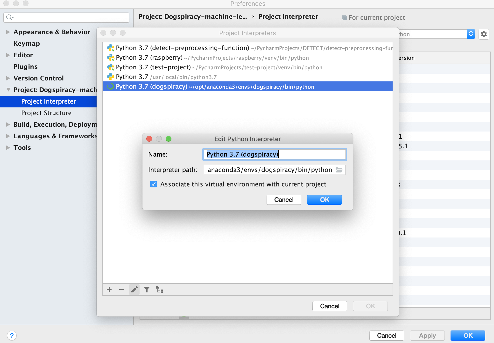

# Dogspiracy-machine-learning

## Setup with Anaconda Navigator
https://docs.anaconda.com/anaconda/user-guide/tasks/pycharm/

Please add the following packages:

*   Tensorflow
*   Tensorboard
*   Keras
*   Numpy
*   Pathlib   
*   Matplotlib (optional)

Make sure to have Python 3.7 installed.

## Setup in PyCharm

### Add Project Interpreter
Open Interpreter Settings and add Anaconda Interpreter.

### Run project

Run file "GetDataReadyForTraining.py" to train the sample data.

## Data Set 
~~https://www.kaggle.com/malhotra1432/dog-breed-prediction-competition/data?~~

To use the entire dataset visit http://vision.stanford.edu/aditya86/ImageNetDogs/ and download the dataset.
Please note: Only the image-dataset is required!

Once you downloaded the images, place them in the folder _stanford/images_ and run this file:
[createTrainAndTestFoldersFromStanfordData.py](_createTrainAndTestFoldersFromStanfordData.py_)