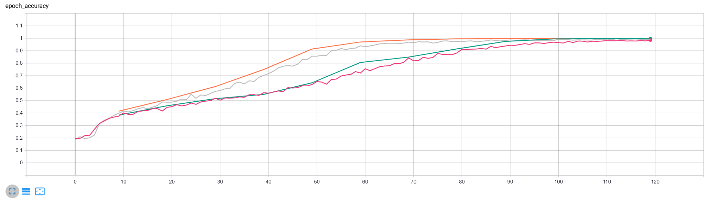
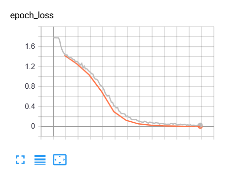

# Dogspiracy-machine-learning

## Setup with Anaconda Navigator
https://docs.anaconda.com/anaconda/user-guide/tasks/pycharm/

Please add the following packages:

*   Tensorflow
*   Tensorboard
*   Keras
*   Numpy
*   Pathlib   
*   Matplotlib (optional)
*   pyyaml

Make sure to have Python 3.7 installed.

## Setup in PyCharm

### Add Project Interpreter
Open Interpreter Settings and add Anaconda Interpreter.

### Run project

Run file ["Main.py"](_Main.py_) to train the sample data.

## Data Set 

A sample of the dataset can be found in the folder _data/images_

To use the entire dataset visit http://vision.stanford.edu/aditya86/ImageNetDogs/ and download the dataset.
Please note: Only the "Images (757MB)" are required as the dataset!

Once you downloaded the images, place them in the folder _data/stanford/images_ and run this file:
[createTrainAndTestFoldersFromStanfordData.py](_createTrainAndTestFoldersFromStanfordData.py_)

## Results
### Model Summary

### Training and Validation
Adam Optimizer:
- training: orange
- validation: blue

RSMProp Optimizer:
- training: green
- validation: grey

Adam vs. RSMprop Optimizer: epoch accuracy

Adam Optimizer loss:

RSMprop Optimizer loss:

### Evaluation
Adam Optimizer:
accuracy: 79%
loss: ??

RSMProp Optimizer:
accuracy: 69%
loss: ??